## Main Repositories
| Repositories | Description | Pages |
|:-:|---|:-:|
| [Ray_Tracing](https://github.com/KTechi/Ray_Tracing) | Renderer using ray tracing. | [view](https://KTechi.github.io/Ray_Tracing/) |
| [Ray_Tracing_GPU](https://github.com/KTechi/Ray_Tracing_GPU) | Renderer using GPU. | [view](https://KTechi.github.io/Ray_Tracing_GPU/) |
| [3D_Scatter_Plot](https://github.com/KTechi/3D_Scatter_Plot) | Program that can plot 3D data. | [view](https://KTechi.github.io/3D_Scatter_Plot/) |
| [QR_Code](https://github.com/KTechi/QR_Code) | QR code generator. | [view](https://KTechi.github.io/QR_Code/) |
| [QR_DeCode](https://github.com/KTechi/QR_DeCode) | QR code decoder. | [view](https://KTechi.github.io/QR_DeCode/) |
| [P2P](https://github.com/KTechi/P2P) | P2P Web App. | [view](https://KTechi.github.io/P2P/) |
| [DataStructures-and-Algorithms](https://github.com/KTechi/DataStructures-and-Algorithms) | DataStructure, Algorithm, Crypto | none |
| [SVG (temporary)](https://github.com/KTechi/SVG-Collections) | Collections of SVG image. | [Under Construction]() |

